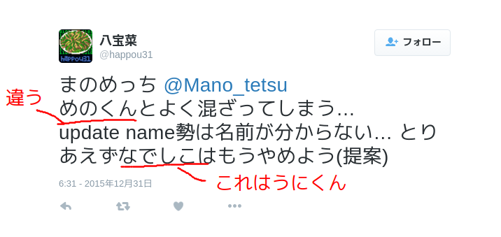
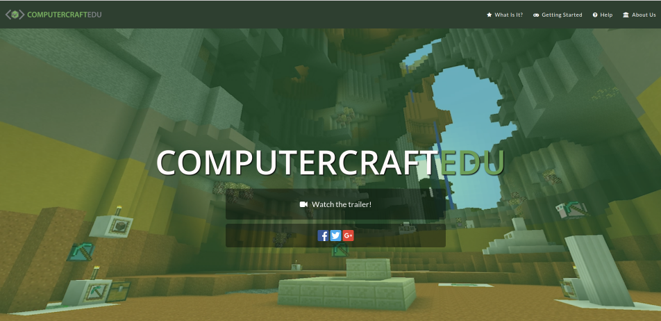

# __ComputerCraftを楽しむ__

---
# 自己紹介

---

- まのめっち
- 13RD
- 作曲もやってるよ

---
# 本題

---
# ComputerCraftってなに？

---

- MinecraftのMOD
- いわゆる工業化MOD
- コンピュータをつくって色々できる
- プログラムを書くことで好みの動作をつくれる

---
# できること 

- 採掘・整地の自動化
- 農地の管理
- モニターを使ってのあれこれ表示
- GUIもつくれる

---
# これらを組み合わせてゲームも作れちゃう！(らしい)

---
# 仲間たち

タートル(turtle)・コンピュータ・ディスクドライブ

---
# おすすめポイント

- 便利
- 名前がをつけられる
- かわいい
- プログラミングの勉強にもなる

---
# コード紹介

---
# luaで書きます

---

    !lua
    function mine(length)  
        -- 掘って  
        for i = 1, length do  
            turtle.dig()   -- 正面を掘る  
            turtle.forward()  -- 正面に進む  
            turtle.digUp()  -- 真上を掘る  
        end  
        -- 戻ってくる
        turtle.turnRight()  -- 右に90°回る  
        turtle.turnRight()  -- もう一回  
        for i = 1, length do  
            turtle.forward()  
        end  
        -- アイテムポイしようね
        for i = 1, 16 do  -- スロットが16あるので16回ループ  
            turtle.select(i)  -- スロット選択  
            turtle.drop()  -- アイテムをポイする  
        end  
        turtle.turnRight()  -- 元の方向に  
        turtle.turnRight()  -- 戻す  
    end  
    args = {...}  -- 引数を入れる  
    mine(args[1])  -- 実行
    
---
# 実際に動かすとこんな感じ

---

[かわいい](2016-01-29 13-28-39.mp4)

---
# 学習環境としてのComputerCraft

ボタンを配置してプログラミングをしていく

---
# まとめ

---
# ComputerCraftたのしい

---
# __turtleかわいい__

---
# __Let's Play!__

---
# ご清聴ありがとうございました
