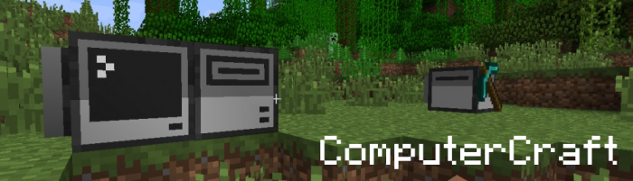

% title: ComputerCraftを楽しむ
% subtitle: luaで友達をつくる
% author: まのめっち
% author: 
% thankyou: ご清聴ありがとうございました
% thankyou_details: And especially these people:
% contact: Twitter Mano_tetsu
% contact: github <a href="http://github.com">asatake</a>

---
title: 自己紹介
build_lists: true
class: img-top-center

- まのめっち
- 13RD
- 作曲もやってるよ

---
title: 本題
subtitle: ComputerCraftってなに？
build_lists: true

- MinecraftのMOD
- いわゆる工業化MOD
- コンピュータをつくって色々できる
- プログラムを書くことで好みの動作をつくれる

---
title: できること
subtitle: 
build_lists: true

- 採掘・整地の自動化
- 農地の管理
- モニターを使ってのあれこれ表示
- GUIもつくれる

- <b>これらを組み合わせてゲームも作れちゃう！</b>

---
title: 仲間たち

タートル(turtle)・コンピュータ・ディスクドライブ

---
title: おすすめポイント
build_lists: true

- 便利
- 名前がをつけられる
- かわいい
- プログラミングの勉強にもなる

---
title: コード紹介

言語はlua  
ただひたすら高さ2でまっすぐ掘るだけのプログラム

---
<pre class="prettyprint" data-lang="lua">
function mine(length)
  -- 掘って
  <b>for i = 1, length do
    turtle.dig()   -- 正面を掘る
    turtle.forward()  -- 正面に進む
    turtle.digUp()  -- 真上を掘る
  end</b>
  -- 戻ってくる
  turtle.turnRight()  -- 右に90°回る
  turtle.turnRight()  -- もう一回
  for i = 1, length do
    turtle.forward()
  end
  -- アイテムをドロップする
  for i = 0, 16 do  -- スロットが16あるので16回ループ
    turtle.select(i)  -- スロット選択
    turtle.drop()  -- アイテムをポイする
  end
  turtle.turnRight()  -- 元の方向に
  turtle.turnRight()  -- 戻す
end

args = {...}  -- 引数を入れる
mine(args[1])  -- 実行
</pre>

---
title: 実際に動かすとこんな感じ

---
title: 教育アプリとして

---
